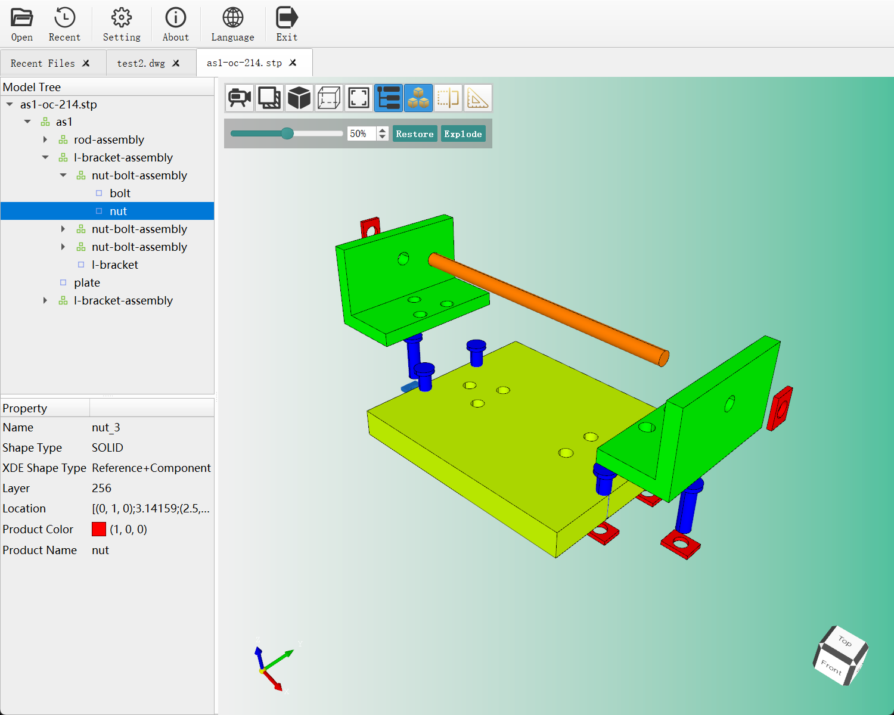
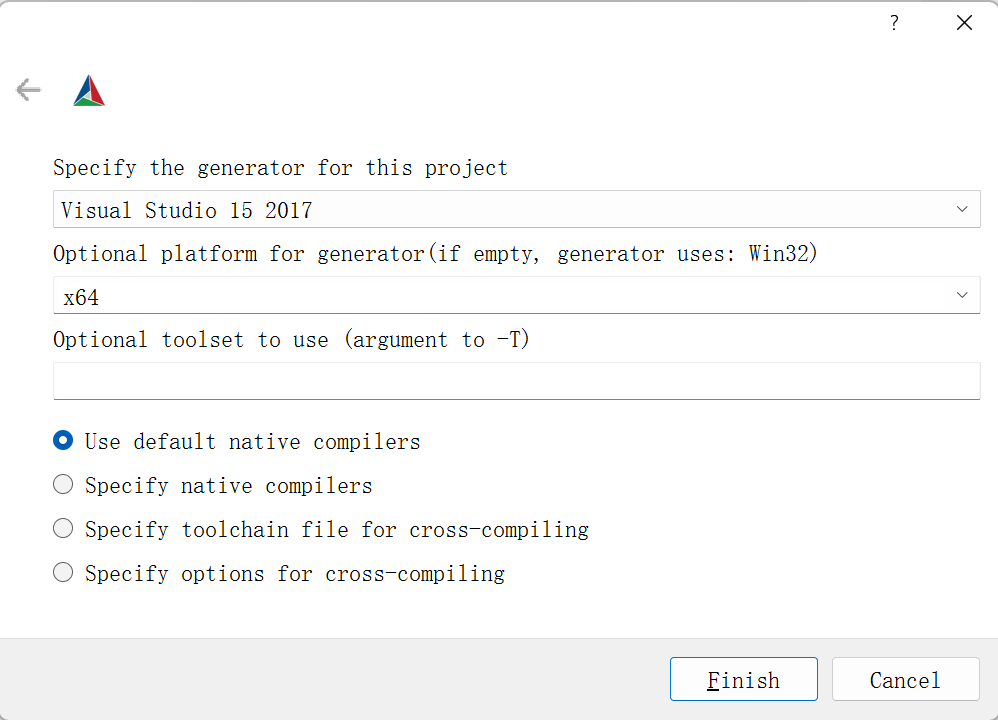
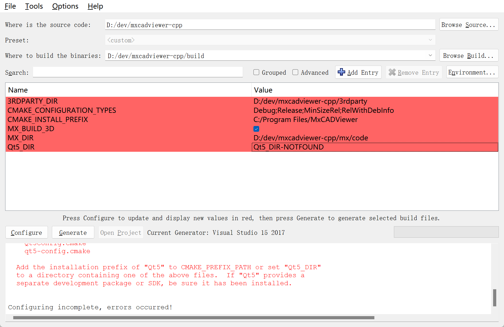
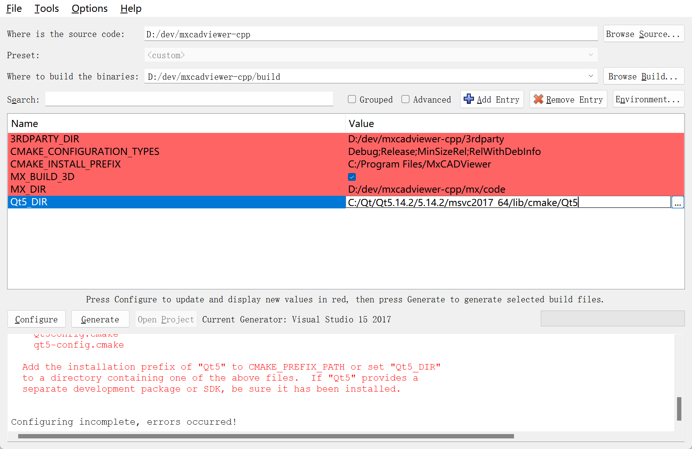
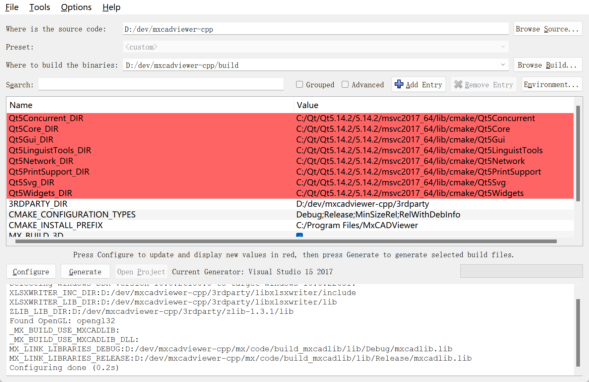
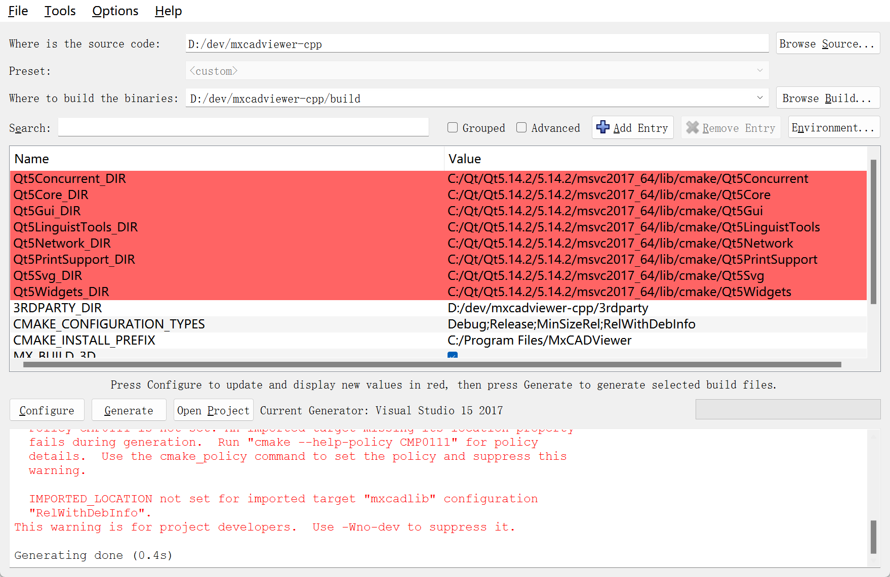

<div align="center">
  
  <p></p>
  <p align="center"><strong>mxcadviewer</strong> An Open-Source 2D/3D Graphics Viewer</p>
  <p></p>
  
  
</div>

# 👓 Feature Overview
- mxcadviewer supports viewing 2D files in formats such as DWG, DXF, and MXWEB, as well as 3D files in formats including STEP, IGES, and STL.
- Supports the **recently opened files** history viewing function.
- The 2D viewing module supports layer management, allowing users to add, delete, modify, query, and copy annotations. It also supports undo and redo operations for annotations, along with a text search feature.
- The 2D viewing module comes with a variety of commonly used annotation objects, including single-line text, multi-line text, lines, rectangles, ellipses, clouds, and leaders. It also supports multiple general measurement annotation objects, covering aligned dimensioning, linear dimensioning, area dimensioning, coordinate dimensioning, arc length dimensioning, point-to-line distance measurement, continuous measurement, batch measurement, side area calculation, area offset, radius measurement, and angle measurement. In addition, it provides table extraction and text extraction functions.
- The 3D viewing module supports functions such as section planes, part explosion, geometric measurement, display mode switching, and view projection mode switching.
- The entire project is developed in **C++**, based on the Qt framework and OpenCASCADE technology stack.

# 🔨 Build Guide
## Dependencies
Install the following tools in advance:
- Git for Windows
- CMake
- Visual Studio 2017

Prepare the following dependent libraries:
- Qt ≥ 5.14
  Note: **Qt5 versions only are supported**
- OpenCascade 7.7.0
- It is recommended to obtain precompiled third-party libraries from [Download Link: 3rdparty.7z](https://www.webcadsdk.com/3rdparty_download.html)
- The mxcadlib library, available for download from [Download Link: mx.7z](https://www.webcadsdk.com/mx_download.html)

## Preparations
1. Pull the latest source code of `mxcadviewer` from `GitHub`:
    ```bash
    git clone https://github.com/mxcad/mxcadviewer-cpp.git
    cd mxcadviewer-cpp
    ```
2. Read `mxcadviewer-cpp/3rdparty/download_address.txt` to download and extract the **third-party libraries**
3. Read `mxcadviewer-cpp/mx/code/download_address.txt` to download and extract the `mxcadlib` library

## CMake Configuration and Project Generation
1. Create a new `build` directory under the `mxcadviewer-cpp` directory for building the program
2. It is recommended to use the **cmake-gui** graphical tool for configuration. Since the third-party libraries and `mxcadlib` library have been downloaded and extracted in the previous steps, CMake will automatically search for library files in the paths `mxcadviewer-cpp/3rdparty/` and `mxcadviewer-cpp/mx/code/` during initial configuration. Therefore, only the Qt5 path needs to be configured.
3. After setting the source path and build path in `cmake-gui`, click the **Configure** button, select the generator type as **VS2017 x64**, and then click **Finish**


4. If prompted that the `Qt5_DIR` variable is not set, configure the corresponding Qt library path for `Qt5_DIR` and click **Configure** again to complete the configuration



5. Click **Generate** to generate Visual Studio 2017 project files

You can then open the project in **Visual Studio 2017** for compilation and execution.
